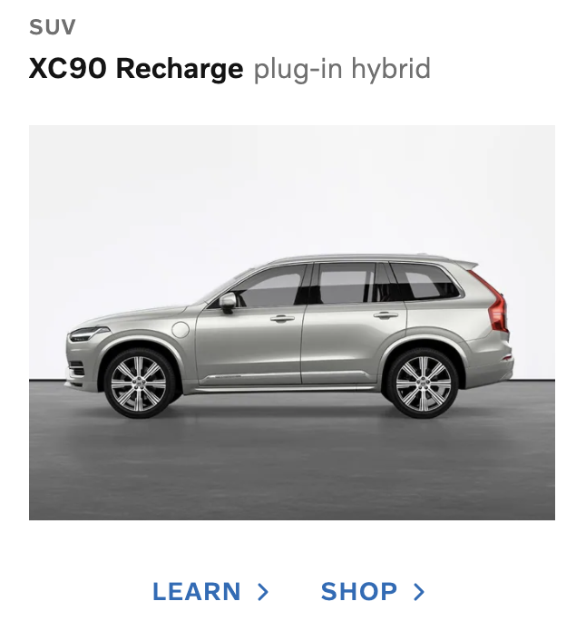

# WebdriverIO e2e boilerplate

## Project Structure

```
.
├── baseline-images/
│   ├── desktop_chrome
│   └── desktop_firefox
├── test/
│   ├── pages/
│   │   ├── components
│   │   ├── campaign/
│   │   │   ├── components/
│   │   │   ├── sections/
│   │   │   └── index.js
│   │   └── ..pageobjects for other modules
│   ├── services/
│   │   ├── browser-capabilities.services.js
│   │   ├── fluent-element.service.js
│   │   └── ...other services
│   ├── specs/
│   │   ├── campaign/
│   │   │   ├── campaign-common.spec.js
│   │   │   ├── campaign-small-screen.spec.js
│   │   │   └── campaign-large-medium-screen.spec.js
│   │   ├── {module-name}/
│   │   │   ├── {module-name}-common.spec.js
│   │   │   └── {module-name}-${screen-size}.spec.js
│   │   └── ...other modules
│   └── utilis/
│       ├── interaction.utils.js
│       └── ...other utils
└── project-related-files
```

## Local setup:

1. Download and install nodejs(preferably version >= v14.x) based on the Operating system
   from [NodeJs download page](https://nodejs.org/en/download/)

2. Download and install docker from [Docker download](https://docs.docker.com/desktop/)

3. Clone the repo to the local machine

```java
git clone 
```

4. Change the working directory to the cloned repo

```
cd 
```

5. Install the dependencies

```
npm install
```

6. Install required browsers (eg. chrome or firefox)

7. Start the selenium server.

```java
npm run webdriver:update
        npm run webdriver:start
```

The above command will download and install selenium server jar file and necessary driver executables and starts the
selenium server at `http://localhost:4444/wd/hub`

8. Run the tests

```java
npm run test
```

## Framework overview:

1. The framework is designed to
   use [Page object model](https://www.selenium.dev/documentation/en/guidelines_and_recommendations/page_object_models/)
   to separate the business logics from webdriver io API
2. For each page in the application, individual page/component classes are created under [pages](./test/pages) directory
   with respective page name. For example, Page Objects for Campaign page is created
   as [page/campaign](./test/pages/campaign).
3. Each repetitive/common UI elements are created as individual resuable components.
   refer [car-model.component.js](./test/pages/campaign/components/car-model.component.js)
4. The test execution can be easily controlled using CLI arguments.
5. Tests can be executed directly form the machine or it can be packaged into a Docker image.

## Writing the first test:

### WebDriverIO overview:

[WebDriver.io](https://webdriver.io/) is a javascript based e2e test automation tools for testing web(using DevTools and
webdriver protocol) and mobile apps(using Appium)

#### Quick example:

```javascript
browser.url("https://www.google.com/");
$("*[name='q']").sendKeys("WebdriverIO");
expect($("*[name='q']").getValue()).toEqual("WebDriverIO");
```

#### Sync and Async mode:

Javascript is by default asynchronous in nature, we need to deal with lots of callbacks and promise to make our tests
run in sequence.

To overcome the above issue, since `ECMAScript 2017`, async and await is introduced to write much cleaner javascript
code by eliminating the need to use promises.
Check [async/await documentation](https://developer.mozilla.org/en-US/docs/Learn/JavaScript/Asynchronous/Async_await) to
understand it in detail.

As mentioned before, Webdriver IO is a JS based framework thus all the methods exposed by browser/element object will
return the promise. We need to carefully use async/await keywords to make our tests run in a sequence.

Currently, webdriver IO supports two modes of execution,

1. Sync
2. Async

#### Async mode:

In async mode, We need to explicitly add async/await statement before each method calls to make our test wait for the
response from the brpwser. Sample code using await keyword

```javascript
async function SearchGoogle() {
    await browser.url("https://www.google.com/");
    await (await $("*[name='q']")).sendKeys("WebdriverIO");
    expect(await $("*[name='q']").getValue()).toEqual("WebDriverIO");
}
```

#### Sync Mode:

If you're using @wdio/sync then you can avoid awaiting for command calls. That means, Webdriver IO has inbuilt
capability(with the help of [node-fiber](https://www.npmjs.com/package/fibers) ) to wait till response is reutned from
async methods, Sample code using sync mode:

```javascript
function SearchGoogle() {
    browser.url("https://www.google.com/");
    $("*[name='q']").sendKeys("WebdriverIO");
    expect($("*[name='q']").getValue()).toEqual("WebDriverIO");
}
```

🚨 But, As of 14/04/2021 sync mode will not be supported anymore starting from Node.js v16 due to changes in Chromium.
So we have to use `Async` mode by default to write out tests.

#### Overcoming the problems in Async mode:

It's not clear that by choosing `Async` it is now necessary to introduce `await` keywork before each and every
asyncronous methods. For example,

```javascript
$(".username").setValue("john");
```

The above code will throw `$(...).setValue is not a function`. To fix this, we need to wrap it with `await` keyword

```javascript
await (await $(".username")).setValue("john");
```

Also, it is impossible to chain the element selector to find hierarchical elements.

```javascript
$(".login-container").$(".username").setValue("john");
```

The above line of code will not work.

To overcome this problem, I have created a new wrapper class [FluentElement](./test/services/fluent-element.service.js)
which eliminates the use of await before each element interactions.

### FluentElement:

WebDriver IO exposed, `$` and `$$` objects to identify the elements from the page.

I have created a new WebDriverIO service `FluentElementService` which exposes, `$f`, `$css`, `$xpath`, `$id`
, `$linkText`, `$partialLinkText` for easy identification of elements.

Example without using `FluentElement`:

```javascript
var loginContainer = await $(".login-container");
var username = await loginContainer.$("#username");
await username.setValue("john");
```

Using `FluentElement`:

```javascript
await $css(".login-container").$id("username").setValue("John");
```

### Creating the page object:

Before writing the test for any new module, its important to create the necessary pageobjects and component.

1. Create a directory with the name of the module under [pages](./test/pages) folder.
2. If the page contains multiple complex sections, then individual sections can be created to make the page class neat
   and clean.
3. Any reusable components for that specific page can be created under [components](./test/pages/campaign/components)
   directory.

Sample directory structure for campaign page is

```
.
└── pages/
    └── campaign/ (Module name)
        ├── components/
        ├── sections/
        └── index.js
```

Sample UI component for car model carousel displayed in campaign page can be created as:
<p align="center">

</p>

```javascript
class CarModel {

    constructor(parentElement) {
        if (!parentElement["wrappedElement"]) {
            parentElement = new FluentElement(null, parentElement)
        }
        this.parentElement = parentElement;
        this.categoryEle = parentElement.$attr("data-autoid", "productListCarouselItem:category");
        this.modelNameEle = parentElement.$attr("data-autoid", "productListCarouselItem:modelName");
        this.rechargeTypeEle = parentElement.$attr("data-autoid", "productListCarouselItem:rechargeType");
        this.learnLink = parentElement.$attr("data-autoid", "productListCarouselItem:link1");
        this.shopLink = parentElement.$attr("data-autoid", "productListCarouselItem:link2");
    }

    categoryName() {
        return getText(this.categoryEle);
    }

    modelName() {
        return getText(this.modelNameEle);
    }

    rechargeType() {
        return getText(this.rechargeTypeEle)
    }

    getImgSrc() {
        return getAttribute(this.parentElement.$css("img"), "src");
    }

}
```

The above component can be used in the tests as

```javascript
var carModel = await CampaignPage.ExploreSection.getModel(0); // returns the first car model displayed in the carousel
expect(await self.carModel.categoryName()).toEqual("SUV");
expect(await self.carModel.modelName()).toEqual("XC90 Recharge");
```